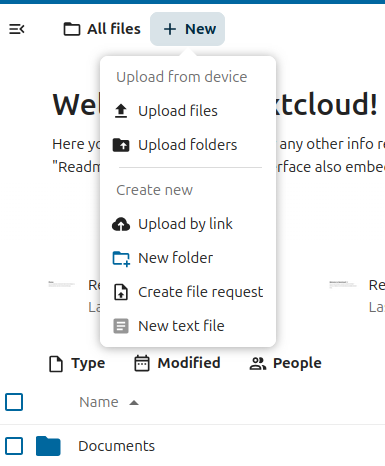
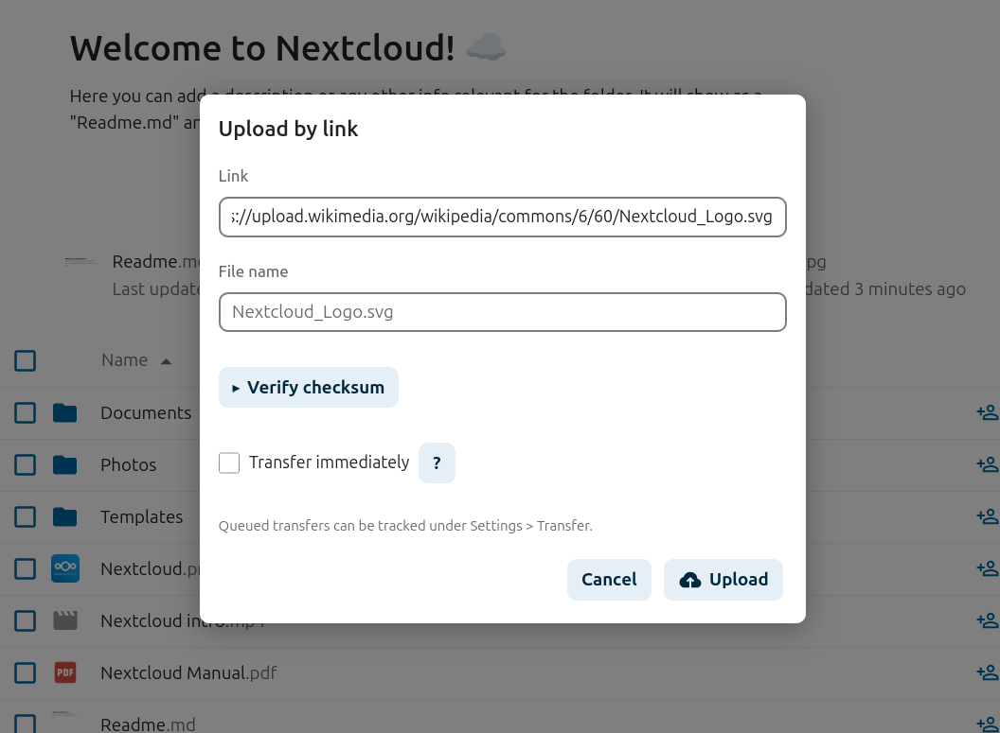

  <picture>
    <source media="(prefers-color-scheme: dark)" srcset="img/app.svg">
    <source media="(prefers-color-scheme: light)" srcset="img/app-dark.svg">
    
  </picture>

<h1 align="center">Nextcloud Transfer</h1>

  <strong>Upload by link</strong> — transfer files into Nextcloud from any URL, 
  using the full bandwidth available to your server.

  
  
  
  

---

## How it works

Select **Upload by link** from the **+** menu in your files view.

Paste a URL and the filename and extension will be detected automatically.
You can optionally provide a checksum to verify the download.

Click **Upload** and the transfer is queued as a background job. You'll get
activity notifications when it starts, completes, or fails.

> [!TIP]
> Queued jobs run on the server's cron schedule — typically within five minutes.
> Configure your server to trigger `cron.php` more often to speed things up.

## Building

You can build with a local toolchain or entirely in a container.

**With podman** (no local Node.js needed):

    make build

**With a local toolchain** (requires Node.js 20+ and npm):

    npm ci && npm run build

Either way the output lands in `js/` and `css/`.
To create a release archive: `make dist`

## Translations

Help translate the app by joining the
[Nextcloud team on Transifex](https://www.transifex.com/nextcloud/nextcloud/).
